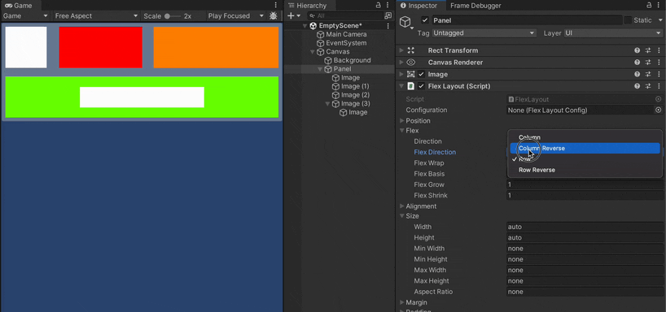

# Flex UI
[](https://openupm.com/packages/com.gilzoide.flex-ui/)

Flexbox support for [Unity UI](https://docs.unity3d.com/Packages/com.unity.ugui@1.0/manual/index.html) using the [Yoga](https://yogalayout.dev/) layout engine.



## Features
- Supported platforms: Windows, Linux, macOS, iOS, tvOS and Android
- There is a single component you need: [FlexLayout](Runtime/FlexLayout.cs)
- Live updates in edit mode.
- `FlexLayout` only lays out children that also have a `FlexLayout` component, so you can still use anchors and other Layout Elements where necessary.
- Set additional layout engine configurations per object using [FlexLayoutConfig](Runtime/FlexLayoutConfig.cs) assets.


## How to install
This package is available on the [openupm registry](https://openupm.com/) and can be installed using the [openupm-cli](https://github.com/openupm/openupm-cli):
```
openupm add com.gilzoide.flex-ui
```

Otherwise, you can install directly using the [Unity Package Manager](https://docs.unity3d.com/Manual/upm-ui-giturl.html) with the following URL:
```
https://github.com/gilzoide/unity-flex-ui.git#1.0.0-preview2
```


## How to use
1. Add a `FlexLayout` component to the UI object that will layout its descendants (children, grandchildren, etc...)
2. Add `FlexLayout` components to the descendants that will be layed out by the root `FlexLayout`s.
3. Configure the layout properties as necessary and see all changes live in edit mode.
4. Enjoy 🍾

All properties can be set in the Inspector as well as by code and the layout will be automatically refreshed.
You can set several values in code and the layout will be calculated only once per frame.

To learn more about the properties supported by `FlexLayout`, check out the Yoga documentation in the "Properties" section: https://yogalayout.dev/docs

You can also set the layout engine configurations by creating `FlexLayoutConfig` assets and setting them to `FlexLayout`'s "Configuration" property.
These configurations include toggling of experimental features and controlling how Yoga rounds floating point values using the "Point Scale Factor" property.


## TODO
[ ] Add property getter/setters in `FlexLayoutConfig`
